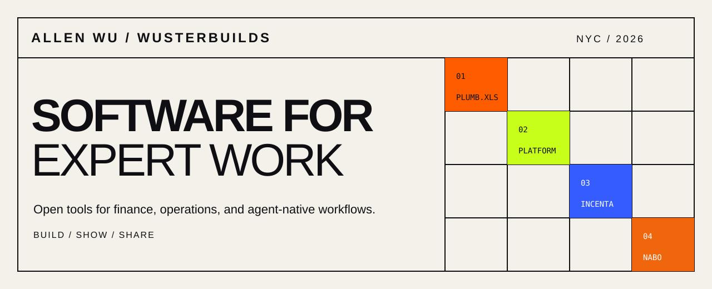

<p align="center">
  
</p>

# Hi, I’m Allen.

I build open-source tools that turn messy, expert workflows into clear and auditable software—usually where AI has to work inside the tools people already use.

Currently building in New York.

## Projects

| Project | What it does | Stage |
| --- | --- | --- |
| [Plumb for Excel](https://github.com/wusterbuilds/plumb-excel) | AI-assisted CRE pro forma review directly in Microsoft Excel | Alpha |
| [Plumb Platform](https://github.com/wusterbuilds/plumb-platform) | Agent-native back office for CRE capital advisory | Research alpha |
| [Incenta](https://github.com/wusterbuilds/incenta) | Finds, stacks, and models real-estate incentives in Excel | Prototype |
| [Nabo](https://github.com/wusterbuilds/nabo) | The executable notepad for paid-media strategy and operations | Prototype |
| [Habitat CLI](https://github.com/wusterbuilds/habitat-cli) | Local-first observability for Codex and Claude Code | Active development |

## How I build

```text
01  start with a real workflow
02  keep the human review point visible
03  make the system inspectable
04  publish the useful boundary
```

The shared visual language for these projects is documented in [BRAND.md](BRAND.md).

## Connect

- [LinkedIn](https://www.linkedin.com/in/you-wu-46a411154/)
- [GitHub](https://github.com/wusterbuilds)
